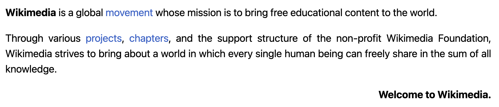

<div align="left">

[](https://wikimedia.org)

# Wikimedia<a id="wikimedia"></a>

This API provides cacheable and straightforward access to Wikimedia content and data, in machine-readable formats.
### Global Rules<a id="global-rules"></a>
- Limit your clients to no more than 200 requests/s to this API.
  Each API endpoint's documentation may detail more specific usage limits.
- Set a unique `User-Agent` or `Api-User-Agent` header that
  allows us to contact you quickly. Email addresses or URLs
  of contact pages work well.

By using this API, you agree to Wikimedia's  [Terms of Use](https://wikimediafoundation.org/wiki/Terms_of_Use) and [Privacy Policy](https://wikimediafoundation.org/wiki/Privacy_policy). Unless otherwise specified in the endpoint documentation below, content accessed via this API is licensed under the [CC-BY-SA 3.0](https://creativecommons.org/licenses/by-sa/3.0/)  and [GFDL](https://www.gnu.org/copyleft/fdl.html) licenses, and you irrevocably agree to release modifications or additions made through this API under these licenses.  See https://www.mediawiki.org/wiki/REST_API for background and details.
### Endpoint documentation<a id="endpoint-documentation"></a>
Please consult each endpoint's documentation for details on:
- Licensing information for the specific type of content
  and data served via the endpoint.
- Stability markers to inform you about development status and
  change policy, according to
  [our API version policy](https://www.mediawiki.org/wiki/API_versioning).
- Endpoint specific usage limits.


</div>

## Table of Contents<a id="table-of-contents"></a>

<!-- toc -->

- [Requirements](#requirements)
- [Installation](#installation)
- [Getting Started](#getting-started)
- [Async](#async)
- [Raw HTTP Response](#raw-http-response)
- [Reference](#reference)
  * [`wikimedia.bytes_difference_data.get_absolute_aggregate_by_project_and_date_range`](#wikimediabytes_difference_dataget_absolute_aggregate_by_project_and_date_range)
  * [`wikimedia.bytes_difference_data.get_absolute_per_page`](#wikimediabytes_difference_dataget_absolute_per_page)
  * [`wikimedia.bytes_difference_data.get_net_aggregate_by_project_and_date_range`](#wikimediabytes_difference_dataget_net_aggregate_by_project_and_date_range)
  * [`wikimedia.bytes_difference_data.get_sum_net_text_bytes_difference_per_page`](#wikimediabytes_difference_dataget_sum_net_text_bytes_difference_per_page)
  * [`wikimedia.edited_pages_data.get_aggregate_by_project_and_date_range`](#wikimediaedited_pages_dataget_aggregate_by_project_and_date_range)
  * [`wikimedia.edited_pages_data.get_new_pages_counts_for_project`](#wikimediaedited_pages_dataget_new_pages_counts_for_project)
  * [`wikimedia.edited_pages_data.get_top_by_absolute_bytes_difference`](#wikimediaedited_pages_dataget_top_by_absolute_bytes_difference)
  * [`wikimedia.edited_pages_data.get_top_by_edits_count`](#wikimediaedited_pages_dataget_top_by_edits_count)
  * [`wikimedia.edited_pages_data.get_top_by_net_bytes_difference`](#wikimediaedited_pages_dataget_top_by_net_bytes_difference)
  * [`wikimedia.editors_data.get_editors_counts_for_project`](#wikimediaeditors_dataget_editors_counts_for_project)
  * [`wikimedia.editors_data.get_top_by_absolute_bytes_difference`](#wikimediaeditors_dataget_top_by_absolute_bytes_difference)
  * [`wikimedia.editors_data.get_top_by_net_bytes_difference`](#wikimediaeditors_dataget_top_by_net_bytes_difference)
  * [`wikimedia.editors_data.get_top_editors_by_edits_count`](#wikimediaeditors_dataget_top_editors_by_edits_count)
  * [`wikimedia.edits_data.get_edits_counts_for_project`](#wikimediaedits_dataget_edits_counts_for_project)
  * [`wikimedia.edits_data.get_page_edit_counts`](#wikimediaedits_dataget_page_edit_counts)
  * [`wikimedia.feed_content_availability.get_by_wiki_domain`](#wikimediafeed_content_availabilityget_by_wiki_domain)
  * [`wikimedia.legacy_data.get_pagecounts_aggregate_by_project_and_date_range`](#wikimedialegacy_dataget_pagecounts_aggregate_by_project_and_date_range)
  * [`wikimedia.math.check_formula`](#wikimediamathcheck_formula)
  * [`wikimedia.math.get_formula_by_hash`](#wikimediamathget_formula_by_hash)
  * [`wikimedia.math.render_formula_by_hash`](#wikimediamathrender_formula_by_hash)
  * [`wikimedia.pageviews_data.get_pageview_counts_by_article_date_range`](#wikimediapageviews_dataget_pageview_counts_by_article_date_range)
  * [`wikimedia.pageviews_data.get_pageview_counts_by_project`](#wikimediapageviews_dataget_pageview_counts_by_project)
  * [`wikimedia.pageviews_data.list_by_country_and_access`](#wikimediapageviews_datalist_by_country_and_access)
  * [`wikimedia.pageviews_data.list_most_viewed_articles_by_project_and_timespan`](#wikimediapageviews_datalist_most_viewed_articles_by_project_and_timespan)
  * [`wikimedia.registered_users_data.get_new_user_counts_by_project_and_date_range`](#wikimediaregistered_users_dataget_new_user_counts_by_project_and_date_range)
  * [`wikimedia.transform.content_machine_translate`](#wikimediatransformcontent_machine_translate)
  * [`wikimedia.transform.content_machine_translate_0`](#wikimediatransformcontent_machine_translate_0)
  * [`wikimedia.transform.get_dictionary_meaning`](#wikimediatransformget_dictionary_meaning)
  * [`wikimedia.transform.get_dictionary_meaning_0`](#wikimediatransformget_dictionary_meaning_0)
  * [`wikimedia.transform.get_list_tool_language_pairs`](#wikimediatransformget_list_tool_language_pairs)
  * [`wikimedia.transform.language_pair_list`](#wikimediatransformlanguage_pair_list)
  * [`wikimedia.transform.list_language_pairs`](#wikimediatransformlist_language_pairs)
  * [`wikimedia.transform.tool_language_pairs_list`](#wikimediatransformtool_language_pairs_list)
  * [`wikimedia.transform.tool_language_pairs_list_0`](#wikimediatransformtool_language_pairs_list_0)
  * [`wikimedia.unique_devices_data.get_by_project_and_date_range`](#wikimediaunique_devices_dataget_by_project_and_date_range)

<!-- tocstop -->

## Requirements<a id="requirements"></a>

Python >=3.7

## Installation<a id="installation"></a>
<div align="center">
  <a href="https://konfigthis.com/sdk-sign-up?company=Wikimedia&language=Python">
    
  </a>
</div>

## Getting Started<a id="getting-started"></a>

```python
from pprint import pprint
from wikimedia_python_sdk import Wikimedia, ApiException

wikimedia = Wikimedia()

try:
    # Get the sum of absolute value of text bytes difference between current edit and previous one.
    get_absolute_aggregate_by_project_and_date_range_response = wikimedia.bytes_difference_data.get_absolute_aggregate_by_project_and_date_range(
        project="project_example",
        editor_type="all-editor-types",
        page_type="all-page-types",
        granularity="daily",
        start="start_example",
        end="end_example",
    )
except ApiException as e:
    print(
        "Exception when calling BytesDifferenceDataApi.get_absolute_aggregate_by_project_and_date_range: %s\n"
        % e
    )
    pprint(e.body)
    pprint(e.headers)
    pprint(e.status)
    pprint(e.reason)
    pprint(e.round_trip_time)
```

## Async<a id="async"></a>

`async` support is available by prepending `a` to any method.

```python
import asyncio
from pprint import pprint
from wikimedia_python_sdk import Wikimedia, ApiException

wikimedia = Wikimedia()


async def main():
    try:
        # Get the sum of absolute value of text bytes difference between current edit and previous one.
        get_absolute_aggregate_by_project_and_date_range_response = await wikimedia.bytes_difference_data.aget_absolute_aggregate_by_project_and_date_range(
            project="project_example",
            editor_type="all-editor-types",
            page_type="all-page-types",
            granularity="daily",
            start="start_example",
            end="end_example",
        )
    except ApiException as e:
        print(
            "Exception when calling BytesDifferenceDataApi.get_absolute_aggregate_by_project_and_date_range: %s\n"
            % e
        )
        pprint(e.body)
        pprint(e.headers)
        pprint(e.status)
        pprint(e.reason)
        pprint(e.round_trip_time)


asyncio.run(main())
```

## Raw HTTP Response<a id="raw-http-response"></a>

To access raw HTTP response values, use the `.raw` namespace.

```python
from pprint import pprint
from wikimedia_python_sdk import Wikimedia, ApiException

wikimedia = Wikimedia()

try:
    # Get the sum of absolute value of text bytes difference between current edit and previous one.
    get_absolute_aggregate_by_project_and_date_range_response = wikimedia.bytes_difference_data.raw.get_absolute_aggregate_by_project_and_date_range(
        project="project_example",
        editor_type="all-editor-types",
        page_type="all-page-types",
        granularity="daily",
        start="start_example",
        end="end_example",
    )
    pprint(get_absolute_aggregate_by_project_and_date_range_response.headers)
    pprint(get_absolute_aggregate_by_project_and_date_range_response.status)
    pprint(get_absolute_aggregate_by_project_and_date_range_response.round_trip_time)
except ApiException as e:
    print(
        "Exception when calling BytesDifferenceDataApi.get_absolute_aggregate_by_project_and_date_range: %s\n"
        % e
    )
    pprint(e.body)
    pprint(e.headers)
    pprint(e.status)
    pprint(e.reason)
    pprint(e.round_trip_time)
```


## Reference<a id="reference"></a>
### `wikimedia.bytes_difference_data.get_absolute_aggregate_by_project_and_date_range`<a id="wikimediabytes_difference_dataget_absolute_aggregate_by_project_and_date_range"></a>

Given a Mediawiki project and a date range, returns a timeseries of absolute bytes
difference sums. You can filter by editors-type (all-editor-types, anonymous, group-bot,
name-bot, user) and page-type (all-page-types, content, non-content). You can choose
between daily and monthly granularity as well.

- Stability: [experimental](https://www.mediawiki.org/wiki/API_versioning#Experimental)
- Rate limit: 25 req/s
- License: Data accessible via this endpoint is available under the
  [CC0 1.0 license](https://creativecommons.org/publicdomain/zero/1.0/).


#### 🛠️ Usage<a id="🛠️-usage"></a>

```python
get_absolute_aggregate_by_project_and_date_range_response = (
    wikimedia.bytes_difference_data.get_absolute_aggregate_by_project_and_date_range(
        project="project_example",
        editor_type="all-editor-types",
        page_type="all-page-types",
        granularity="daily",
        start="start_example",
        end="end_example",
    )
)
```

#### ⚙️ Parameters<a id="⚙️-parameters"></a>

##### project: `str`<a id="project-str"></a>

The name of any Wikimedia project formatted like {language code}.{project name}, for example en.wikipedia. You may pass en.wikipedia.org and the .org will be stripped off. For projects like commons without language codes, use commons.wikimedia. For projects like www.mediawiki.org, you can use that full string, or just use mediawiki or mediawiki.org. If you're interested in the aggregation of all projects, use all-projects. 

##### editor_type: `str`<a id="editor_type-str"></a>

If you want to filter by editor-type, use one of anonymous, group-bot (registered accounts belonging to the bot group), name-bot (registered accounts not belonging to the bot group but having bot-like names) or user (registered account not in bot group nor having bot-like name). If you are interested in edits regardless of their editor-type, use all-editor-types. 

##### page_type: `str`<a id="page_type-str"></a>

If you want to filter by page-type, use one of content (edits on pages in content namespaces) or non-content (edits on pages in non-content namespaces). If you are interested in edits regardless of their page-type, use all-page-types. 

##### granularity: `str`<a id="granularity-str"></a>

Time unit for the response data. As of today, supported values are daily and monthly 

##### start: `str`<a id="start-str"></a>

The date of the first day to include, in YYYYMMDD format

##### end: `str`<a id="end-str"></a>

The date of the last day to include, in YYYYMMDD format

#### 🌐 Endpoint<a id="🌐-endpoint"></a>

`/metrics/bytes-difference/absolute/aggregate/{project}/{editor-type}/{page-type}/{granularity}/{start}/{end}` `get`

[🔙 **Back to Table of Contents**](#table-of-contents)

---

### `wikimedia.bytes_difference_data.get_absolute_per_page`<a id="wikimediabytes_difference_dataget_absolute_per_page"></a>

Given a Mediawiki project, a page-title prefixed with canonical namespace (for
instance 'User:Jimbo_Wales') and a date range, returns a timeseries of bytes
difference absolute sums. You can filter by editors-type (all-editor-types, anonymous,
group-bot, name-bot, user). You can choose between daily and monthly granularity as well.

- Stability: [experimental](https://www.mediawiki.org/wiki/API_versioning#Experimental)
- Rate limit: 25 req/s
- License: Data accessible via this endpoint is available under the
  [CC0 1.0 license](https://creativecommons.org/publicdomain/zero/1.0/).


#### 🛠️ Usage<a id="🛠️-usage"></a>

```python
get_absolute_per_page_response = wikimedia.bytes_difference_data.get_absolute_per_page(
    project="project_example",
    page_title="page-title_example",
    editor_type="all-editor-types",
    granularity="daily",
    start="start_example",
    end="end_example",
)
```

#### ⚙️ Parameters<a id="⚙️-parameters"></a>

##### project: `str`<a id="project-str"></a>

The name of any Wikimedia project formatted like {language code}.{project name}, for example en.wikipedia. You may pass en.wikipedia.org and the .org will be stripped off. For projects like commons without language codes, use commons.wikimedia. For projects like www.mediawiki.org, you can use that full string, or just use mediawiki or mediawiki.org. 

##### page_title: `str`<a id="page_title-str"></a>

The page-title to request absolute bytes-difference for. Should be prefixed with the page canonical namespace. 

##### editor_type: `str`<a id="editor_type-str"></a>

If you want to filter by editor-type, use one of anonymous, group-bot (registered accounts belonging to the bot group), name-bot (registered accounts not belonging to the bot group but having bot-like names) or user (registered account not in bot group nor having bot-like name). If you are interested in edits regardless of their editor-type, use all-editor-types. 

##### granularity: `str`<a id="granularity-str"></a>

Time unit for the response data. As of today, supported values are daily and monthly 

##### start: `str`<a id="start-str"></a>

The date of the first day to include, in YYYYMMDD format

##### end: `str`<a id="end-str"></a>

The date of the last day to include, in YYYYMMDD format

#### 🌐 Endpoint<a id="🌐-endpoint"></a>

`/metrics/bytes-difference/absolute/per-page/{project}/{page-title}/{editor-type}/{granularity}/{start}/{end}` `get`

[🔙 **Back to Table of Contents**](#table-of-contents)

---

### `wikimedia.bytes_difference_data.get_net_aggregate_by_project_and_date_range`<a id="wikimediabytes_difference_dataget_net_aggregate_by_project_and_date_range"></a>

Given a Mediawiki project and a date range, returns a timeseries of bytes difference net
sums. You can filter by editors-type (all-editor-types, anonymous, group-bot, name-bot,
user) and page-type (all-page-types, content or non-content). You can choose between
daily and monthly granularity as well.

- Stability: [experimental](https://www.mediawiki.org/wiki/API_versioning#Experimental)
- Rate limit: 25 req/s
- License: Data accessible via this endpoint is available under the
  [CC0 1.0 license](https://creativecommons.org/publicdomain/zero/1.0/).


#### 🛠️ Usage<a id="🛠️-usage"></a>

```python
get_net_aggregate_by_project_and_date_range_response = (
    wikimedia.bytes_difference_data.get_net_aggregate_by_project_and_date_range(
        project="project_example",
        editor_type="all-editor-types",
        page_type="all-page-types",
        granularity="daily",
        start="start_example",
        end="end_example",
    )
)
```

#### ⚙️ Parameters<a id="⚙️-parameters"></a>

##### project: `str`<a id="project-str"></a>

The name of any Wikimedia project formatted like {language code}.{project name}, for example en.wikipedia. You may pass en.wikipedia.org and the .org will be stripped off. For projects like commons without language codes, use commons.wikimedia. For projects like www.mediawiki.org, you can use that full string, or just use mediawiki or mediawiki.org. If you're interested in the aggregation of all projects, use all-projects. 

##### editor_type: `str`<a id="editor_type-str"></a>

If you want to filter by editor-type, use one of anonymous, group-bot (registered accounts belonging to the bot group), name-bot (registered accounts not belonging to the bot group but having bot-like names) or user (registered account not in bot group nor having bot-like name). If you are interested in edits regardless of their editor-type, use all-editor-types. 

##### page_type: `str`<a id="page_type-str"></a>

If you want to filter by page-type, use one of content (edits on pages in content namespaces) or non-content (edits on pages in non-content namespaces). If you are interested in edits regardless of their page-type, use all-page-types. 

##### granularity: `str`<a id="granularity-str"></a>

Time unit for the response data. As of today, supported values are daily and monthly 

##### start: `str`<a id="start-str"></a>

The date of the first day to include, in YYYYMMDD format

##### end: `str`<a id="end-str"></a>

The date of the last day to include, in YYYYMMDD format

#### 🌐 Endpoint<a id="🌐-endpoint"></a>

`/metrics/bytes-difference/net/aggregate/{project}/{editor-type}/{page-type}/{granularity}/{start}/{end}` `get`

[🔙 **Back to Table of Contents**](#table-of-contents)

---

### `wikimedia.bytes_difference_data.get_sum_net_text_bytes_difference_per_page`<a id="wikimediabytes_difference_dataget_sum_net_text_bytes_difference_per_page"></a>

Given a Mediawiki project, a page-title prefixed with canonical namespace (for
instance 'User:Jimbo_Wales') and a date range, returns a timeseries of bytes
difference net sums. You can filter by editors-type (all-editor-types, anonymous,
group-bot, name-bot, user). You can choose between daily and monthly granularity as well.

- Stability: [experimental](https://www.mediawiki.org/wiki/API_versioning#Experimental)
- Rate limit: 25 req/s
- License: Data accessible via this endpoint is available under the
  [CC0 1.0 license](https://creativecommons.org/publicdomain/zero/1.0/).


#### 🛠️ Usage<a id="🛠️-usage"></a>

```python
get_sum_net_text_bytes_difference_per_page_response = (
    wikimedia.bytes_difference_data.get_sum_net_text_bytes_difference_per_page(
        project="project_example",
        page_title="page-title_example",
        editor_type="all-editor-types",
        granularity="daily",
        start="start_example",
        end="end_example",
    )
)
```

#### ⚙️ Parameters<a id="⚙️-parameters"></a>

##### project: `str`<a id="project-str"></a>

The name of any Wikimedia project formatted like {language code}.{project name}, for example en.wikipedia. You may pass en.wikipedia.org and the .org will be stripped off. For projects like commons without language codes, use commons.wikimedia. For projects like www.mediawiki.org, you can use that full string, or just use mediawiki or mediawiki.org. 

##### page_title: `str`<a id="page_title-str"></a>

The page-title to request net bytes-difference for. Should be prefixed with the page canonical namespace. 

##### editor_type: `str`<a id="editor_type-str"></a>

If you want to filter by editor-type, use one of anonymous, group-bot (registered accounts belonging to the bot group), name-bot (registered accounts not belonging to the bot group but having bot-like names) or user (registered account not in bot group nor having bot-like name). If you are interested in edits regardless of their editor-type, use all-editor-types. 

##### granularity: `str`<a id="granularity-str"></a>

Time unit for the response data. As of today, supported values are daily and monthly 

##### start: `str`<a id="start-str"></a>

The date of the first day to include, in YYYYMMDD format

##### end: `str`<a id="end-str"></a>

The date of the last day to include, in YYYYMMDD format

#### 🌐 Endpoint<a id="🌐-endpoint"></a>

`/metrics/bytes-difference/net/per-page/{project}/{page-title}/{editor-type}/{granularity}/{start}/{end}` `get`

[🔙 **Back to Table of Contents**](#table-of-contents)

---

### `wikimedia.edited_pages_data.get_aggregate_by_project_and_date_range`<a id="wikimediaedited_pages_dataget_aggregate_by_project_and_date_range"></a>

Given a Mediawiki project and a date range, returns a timeseries of its edited-pages counts.
You can filter by editor-type (all-editor-types, anonymous, group-bot, name-bot, user),
page-type (all-page-types, content or non-content) or activity-level (1..4-edits,
5..24-edits, 25..99-edits, 100..-edits). You can choose between daily and monthly
granularity as well.

- Stability: [experimental](https://www.mediawiki.org/wiki/API_versioning#Experimental)
- Rate limit: 25 req/s
- License: Data accessible via this endpoint is available under the
  [CC0 1.0 license](https://creativecommons.org/publicdomain/zero/1.0/).


#### 🛠️ Usage<a id="🛠️-usage"></a>

```python
get_aggregate_by_project_and_date_range_response = (
    wikimedia.edited_pages_data.get_aggregate_by_project_and_date_range(
        project="project_example",
        editor_type="all-editor-types",
        page_type="all-page-types",
        activity_level="all-activity-levels",
        granularity="daily",
        start="start_example",
        end="end_example",
    )
)
```

#### ⚙️ Parameters<a id="⚙️-parameters"></a>

##### project: `str`<a id="project-str"></a>

The name of any Wikimedia project formatted like {language code}.{project name}, for example en.wikipedia. You may pass en.wikipedia.org and the .org will be stripped off.  For projects like commons without language codes, use commons.wikimedia. For projects like www.mediawiki.org, you can use that full string, or just use mediawiki or mediawiki.org. 

##### editor_type: `str`<a id="editor_type-str"></a>

If you want to filter by editor-type, use one of anonymous, group-bot (registered accounts belonging to the bot group), name-bot (registered accounts not belonging to the bot group but having bot-like names) or user (registered account not in bot group nor having bot-like name). If you are interested in edits regardless of their editor-type, use all-editor-types. 

##### page_type: `str`<a id="page_type-str"></a>

If you want to filter by page-type, use one of content (edited-pages in content namespaces) or non-content (edited-pages in non-content namespaces). If you are interested in edited-pages regardless of their page-type, use all-page-types. 

##### activity_level: `str`<a id="activity_level-str"></a>

If you want to filter by activity-level, use one of 1..4-edits, 5..24-edits, 25..99-edits or 100..-edits. If you are interested in edited-pages regardless of their activity level, use all-activity-levels. 

##### granularity: `str`<a id="granularity-str"></a>

The time unit for the response data. As of today, supported values are daily and monthly. 

##### start: `str`<a id="start-str"></a>

The date of the first day to include, in YYYYMMDD format

##### end: `str`<a id="end-str"></a>

The date of the last day to include, in YYYYMMDD format

#### 🌐 Endpoint<a id="🌐-endpoint"></a>

`/metrics/edited-pages/aggregate/{project}/{editor-type}/{page-type}/{activity-level}/{granularity}/{start}/{end}` `get`

[🔙 **Back to Table of Contents**](#table-of-contents)

---

### `wikimedia.edited_pages_data.get_new_pages_counts_for_project`<a id="wikimediaedited_pages_dataget_new_pages_counts_for_project"></a>

Given a Mediawiki project and a date range, returns a timeseries of its new pages counts.
You can filter by editor type (all-editor-types, anonymous, group-bot, name-bot, user)
or page-type (all-page-types, content or non-content). You can choose between daily and
monthly granularity as well.

- Stability: [experimental](https://www.mediawiki.org/wiki/API_versioning#Experimental)
- Rate limit: 25 req/s
- License: Data accessible via this endpoint is available under the
  [CC0 1.0 license](https://creativecommons.org/publicdomain/zero/1.0/).


#### 🛠️ Usage<a id="🛠️-usage"></a>

```python
get_new_pages_counts_for_project_response = (
    wikimedia.edited_pages_data.get_new_pages_counts_for_project(
        project="project_example",
        editor_type="all-editor-types",
        page_type="all-page-types",
        granularity="daily",
        start="start_example",
        end="end_example",
    )
)
```

#### ⚙️ Parameters<a id="⚙️-parameters"></a>

##### project: `str`<a id="project-str"></a>

The name of any Wikimedia project formatted like {language code}.{project name}, for example en.wikipedia. You may pass en.wikipedia.org and the .org will be stripped off.  For projects like commons without language codes, use commons.wikimedia. For projects like www.mediawiki.org, you can use that full string, or just use mediawiki or mediawiki.org. If you're interested in the aggregation of all projects, use all-projects. 

##### editor_type: `str`<a id="editor_type-str"></a>

If you want to filter by editor-type, use one of anonymous, group-bot (registered accounts belonging to the bot group), name-bot (registered accounts not belonging to the bot group but having bot-like names) or user (registered account not in bot group nor having bot-like name). If you are interested in edits regardless of their editor-type, use all-editor-types. 

##### page_type: `str`<a id="page_type-str"></a>

If you want to filter by page-type, use one of content (new pages in content namespaces) or non-content (new pages in non-content namespaces). If you are interested in new-articles regardless of their page-type, use all-page-types. 

##### granularity: `str`<a id="granularity-str"></a>

The time unit for the response data. As of today, supported values are daily and monthly. 

##### start: `str`<a id="start-str"></a>

The date of the first day to include, in YYYYMMDD format

##### end: `str`<a id="end-str"></a>

The date of the last day to include, in YYYYMMDD format

#### 🌐 Endpoint<a id="🌐-endpoint"></a>

`/metrics/edited-pages/new/{project}/{editor-type}/{page-type}/{granularity}/{start}/{end}` `get`

[🔙 **Back to Table of Contents**](#table-of-contents)

---

### `wikimedia.edited_pages_data.get_top_by_absolute_bytes_difference`<a id="wikimediaedited_pages_dataget_top_by_absolute_bytes_difference"></a>

Given a Mediawiki project and a date (day or month), returns a timeseries of the top 100
edited-pages by absolute bytes-difference. You can filter by editor-type (all-editor-types,
anonymous, group-bot, name-bot, user) or page-type (all-page-types, content or non-content).

- Stability: [experimental](https://www.mediawiki.org/wiki/API_versioning#Experimental)
- Rate limit: 25 req/s
- License: Data accessible via this endpoint is available under the
  [CC0 1.0 license](https://creativecommons.org/publicdomain/zero/1.0/).


#### 🛠️ Usage<a id="🛠️-usage"></a>

```python
get_top_by_absolute_bytes_difference_response = (
    wikimedia.edited_pages_data.get_top_by_absolute_bytes_difference(
        project="project_example",
        editor_type="all-editor-types",
        page_type="all-page-types",
        year="year_example",
        month="month_example",
        day="day_example",
    )
)
```

#### ⚙️ Parameters<a id="⚙️-parameters"></a>

##### project: `str`<a id="project-str"></a>

The name of any Wikimedia project formatted like {language code}.{project name}, for example en.wikipedia. You may pass en.wikipedia.org and the .org will be stripped off. For projects like commons without language codes, use commons.wikimedia. For projects like www.mediawiki.org, you can use that full string, or just use mediawiki or mediawiki.org. 

##### editor_type: `str`<a id="editor_type-str"></a>

If you want to filter by editor-type, use one of anonymous, group-bot (registered accounts belonging to the bot group), name-bot (registered accounts not belonging to the bot group but having bot-like names) or user (registered account not in bot group nor having bot-like name). If you are interested in edits regardless of their editor-type, use all-editor-types. 

##### page_type: `str`<a id="page_type-str"></a>

If you want to filter by page-type, use one of content (edits on pages in content namespaces) or non-content (edits on pages in non-content namespaces). If you are interested in edits regardless of their page-type, use all-page-types. 

##### year: `str`<a id="year-str"></a>

The year of the date for which to retrieve top edited-pages, in YYYY format.

##### month: `str`<a id="month-str"></a>

The month of the date for which to retrieve top edited-pages, in MM format. If you want to get the top edited-pages of a whole month, the day parameter should be all-days.

##### day: `str`<a id="day-str"></a>

The day of the date for which to retrieve top edited-pages, in DD format, or all-days for a monthly value.

#### 🌐 Endpoint<a id="🌐-endpoint"></a>

`/metrics/edited-pages/top-by-absolute-bytes-difference/{project}/{editor-type}/{page-type}/{year}/{month}/{day}` `get`

[🔙 **Back to Table of Contents**](#table-of-contents)

---

### `wikimedia.edited_pages_data.get_top_by_edits_count`<a id="wikimediaedited_pages_dataget_top_by_edits_count"></a>

Given a Mediawiki project and a date (day or month), returns a timeseries of the top
100 edited-pages by edits count. You can filter by editor-type (all-editor-types,
anonymous, group-bot, name-bot, user) or page-type (all-page-types, content or
non-content).

- Stability: [experimental](https://www.mediawiki.org/wiki/API_versioning#Experimental)
- Rate limit: 25 req/s
- License: Data accessible via this endpoint is available under the
  [CC0 1.0 license](https://creativecommons.org/publicdomain/zero/1.0/).


#### 🛠️ Usage<a id="🛠️-usage"></a>

```python
get_top_by_edits_count_response = wikimedia.edited_pages_data.get_top_by_edits_count(
    project="project_example",
    editor_type="all-editor-types",
    page_type="all-page-types",
    year="year_example",
    month="month_example",
    day="day_example",
)
```

#### ⚙️ Parameters<a id="⚙️-parameters"></a>

##### project: `str`<a id="project-str"></a>

The name of any Wikimedia project formatted like {language code}.{project name}, for example en.wikipedia. You may pass en.wikipedia.org and the .org will be stripped off. For projects like commons without language codes, use commons.wikimedia. For projects like www.mediawiki.org, you can use that full string, or just use mediawiki or mediawiki.org. 

##### editor_type: `str`<a id="editor_type-str"></a>

If you want to filter by editor-type, use one of anonymous, group-bot (registered accounts belonging to the bot group), name-bot (registered accounts not belonging to the bot group but having bot-like names) or user (registered account not in bot group nor having bot-like name). If you are interested in edits regardless of their editor-type, use all-editor-types. 

##### page_type: `str`<a id="page_type-str"></a>

If you want to filter by page-type, use one of content (edits on pages in content namespaces) or non-content (edits on pages in non-content namespaces). If you are interested in edits regardless of their page-type, use all-page-types. 

##### year: `str`<a id="year-str"></a>

The year of the date for which to retrieve top edited-pages, in YYYY format.

##### month: `str`<a id="month-str"></a>

The month of the date for which to retrieve top edited-pages, in MM format. If you want to get the top edited-pages of a whole month, the day parameter should be all-days.

##### day: `str`<a id="day-str"></a>

The day of the date for which to retrieve top edited-pages, in DD format, or all-days for a monthly value.

#### 🌐 Endpoint<a id="🌐-endpoint"></a>

`/metrics/edited-pages/top-by-edits/{project}/{editor-type}/{page-type}/{year}/{month}/{day}` `get`

[🔙 **Back to Table of Contents**](#table-of-contents)

---

### `wikimedia.edited_pages_data.get_top_by_net_bytes_difference`<a id="wikimediaedited_pages_dataget_top_by_net_bytes_difference"></a>

Given a Mediawiki project and a date (day or month), returns a timeseries of the top 100
edited-pages by net bytes-difference. You can filter by editor-type (all-editor-types,
anonymous, group-bot, name-bot, user) or page-type (all-page-types, content or non-content).

- Stability: [experimental](https://www.mediawiki.org/wiki/API_versioning#Experimental)
- Rate limit: 25 req/s
- License: Data accessible via this endpoint is available under the
  [CC0 1.0 license](https://creativecommons.org/publicdomain/zero/1.0/).


#### 🛠️ Usage<a id="🛠️-usage"></a>

```python
get_top_by_net_bytes_difference_response = (
    wikimedia.edited_pages_data.get_top_by_net_bytes_difference(
        project="project_example",
        editor_type="all-editor-types",
        page_type="all-page-types",
        year="year_example",
        month="month_example",
        day="day_example",
    )
)
```

#### ⚙️ Parameters<a id="⚙️-parameters"></a>

##### project: `str`<a id="project-str"></a>

The name of any Wikimedia project formatted like {language code}.{project name}, for example en.wikipedia. You may pass en.wikipedia.org and the .org will be stripped off. For projects like commons without language codes, use commons.wikimedia. For projects like www.mediawiki.org, you can use that full string, or just use mediawiki or mediawiki.org. 

##### editor_type: `str`<a id="editor_type-str"></a>

If you want to filter by editor-type, use one of anonymous, group-bot (registered accounts belonging to the bot group), name-bot (registered accounts not belonging to the bot group but having bot-like names) or user (registered account not in bot group nor having bot-like name). If you are interested in edits regardless of their editor-type, use all-editor-types. 

##### page_type: `str`<a id="page_type-str"></a>

If you want to filter by page-type, use one of content (edits on pages in content namespaces) or non-content (edits on pages in non-content namespaces). If you are interested in edits regardless of their page-type, use all-page-types. 

##### year: `str`<a id="year-str"></a>

The year of the date for which to retrieve top edited-pages, in YYYY format.

##### month: `str`<a id="month-str"></a>

The month of the date for which to retrieve top edited-pages, in MM format. If you want to get the top edited-pages of a whole month, the day parameter should be all-days.

##### day: `str`<a id="day-str"></a>

The day of the date for which to retrieve top edited-pages, in DD format, or all-days for a monthly value.

#### 🌐 Endpoint<a id="🌐-endpoint"></a>

`/metrics/edited-pages/top-by-net-bytes-difference/{project}/{editor-type}/{page-type}/{year}/{month}/{day}` `get`

[🔙 **Back to Table of Contents**](#table-of-contents)

---

### `wikimedia.editors_data.get_editors_counts_for_project`<a id="wikimediaeditors_dataget_editors_counts_for_project"></a>

Given a Mediawiki project and a date range, returns a timeseries of its editors counts.
You can filter by editory-type (all-editor-types, anonymous, group-bot, name-bot, user),
page-type (all-page-types, content or non-content) or activity-level (1..4-edits,
5..24-edits, 25..99-edits or 100..-edits). You can choose between daily and monthly
granularity as well.

- Stability: [experimental](https://www.mediawiki.org/wiki/API_versioning#Experimental)
- Rate limit: 25 req/s
- License: Data accessible via this endpoint is available under the
  [CC0 1.0 license](https://creativecommons.org/publicdomain/zero/1.0/).


#### 🛠️ Usage<a id="🛠️-usage"></a>

```python
get_editors_counts_for_project_response = (
    wikimedia.editors_data.get_editors_counts_for_project(
        project="project_example",
        editor_type="all-editor-types",
        page_type="all-page-types",
        activity_level="all-activity-levels",
        granularity="daily",
        start="start_example",
        end="end_example",
    )
)
```

#### ⚙️ Parameters<a id="⚙️-parameters"></a>

##### project: `str`<a id="project-str"></a>

The name of any Wikimedia project formatted like {language code}.{project name}, for example en.wikipedia. You may pass en.wikipedia.org and the .org will be stripped off.  For projects like commons without language codes, use commons.wikimedia. For projects like www.mediawiki.org, you can use that full string, or just use mediawiki or mediawiki.org. 

##### editor_type: `str`<a id="editor_type-str"></a>

If you want to filter by editor-type, use one of anonymous, group-bot (registered accounts belonging to the bot group), name-bot (registered accounts not belonging to the bot group but having bot-like names) or user (registered account not in bot group nor having bot-like name). If you are interested in edits regardless of their editor-type, use all-editor-types. 

##### page_type: `str`<a id="page_type-str"></a>

If you want to filter by page-type, use one of content (edits made in content namespaces) or non-content (edits made in non-content namespaces). If you are interested in editors regardless of their page-type, use all-page-types. 

##### activity_level: `str`<a id="activity_level-str"></a>

If you want to filter by activity-level, use one of 1..4-edits, 5..24-edits, 25..99-edits or 100..-edits. If you are interested in editors regardless of their activity-level, use all-activity-levels. 

##### granularity: `str`<a id="granularity-str"></a>

The time unit for the response data. As of today, supported values are daily and monthly. 

##### start: `str`<a id="start-str"></a>

The date of the first day to include, in YYYYMMDD format

##### end: `str`<a id="end-str"></a>

The date of the last day to include, in YYYYMMDD format

#### 🌐 Endpoint<a id="🌐-endpoint"></a>

`/metrics/editors/aggregate/{project}/{editor-type}/{page-type}/{activity-level}/{granularity}/{start}/{end}` `get`

[🔙 **Back to Table of Contents**](#table-of-contents)

---

### `wikimedia.editors_data.get_top_by_absolute_bytes_difference`<a id="wikimediaeditors_dataget_top_by_absolute_bytes_difference"></a>

Given a Mediawiki project and a date (day or month), returns a timeseries of the top 100
editors by absolute bytes-difference. You can filter by editor-type (all-editor-types,
anonymous, group-bot, name-bot, user) or page-type (all-page-types, content or non-content).
The user_text returned is either the mediawiki user_text if the user is registered, or
null if user is anonymous.

- Stability: [experimental](https://www.mediawiki.org/wiki/API_versioning#Experimental)
- Rate limit: 25 req/s
- License: Data accessible via this endpoint is available under the
  [CC0 1.0 license](https://creativecommons.org/publicdomain/zero/1.0/).


#### 🛠️ Usage<a id="🛠️-usage"></a>

```python
get_top_by_absolute_bytes_difference_response = (
    wikimedia.editors_data.get_top_by_absolute_bytes_difference(
        project="project_example",
        editor_type="all-editor-types",
        page_type="all-page-types",
        year="year_example",
        month="month_example",
        day="day_example",
    )
)
```

#### ⚙️ Parameters<a id="⚙️-parameters"></a>

##### project: `str`<a id="project-str"></a>

The name of any Wikimedia project formatted like {language code}.{project name}, for example en.wikipedia. You may pass en.wikipedia.org and the .org will be stripped off. For projects like commons without language codes, use commons.wikimedia. For projects like www.mediawiki.org, you can use that full string, or just use mediawiki or mediawiki.org. 

##### editor_type: `str`<a id="editor_type-str"></a>

If you want to filter by editor-type, use one of anonymous, group-bot (registered accounts belonging to the bot group), name-bot (registered accounts not belonging to the bot group but having bot-like names) or user (registered account not in bot group nor having bot-like name). If you are interested in edits regardless of their editor-type, use all-editor-types. 

##### page_type: `str`<a id="page_type-str"></a>

If you want to filter by page-type, use one of content (edits on pages in content namespaces) or non-content (edits on pages in non-content namespaces). If you are interested in edits regardless of their page-type, use all-page-types. 

##### year: `str`<a id="year-str"></a>

The year of the date for which to retrieve top editors, in YYYY format.

##### month: `str`<a id="month-str"></a>

The month of the date for which to retrieve top editors, in MM format. If you want to get the top editors of a whole month, the day parameter should be all-days.

##### day: `str`<a id="day-str"></a>

The day of the date for which to retrieve top editors, in DD format, or all-days for a monthly value.

#### 🌐 Endpoint<a id="🌐-endpoint"></a>

`/metrics/editors/top-by-absolute-bytes-difference/{project}/{editor-type}/{page-type}/{year}/{month}/{day}` `get`

[🔙 **Back to Table of Contents**](#table-of-contents)

---

### `wikimedia.editors_data.get_top_by_net_bytes_difference`<a id="wikimediaeditors_dataget_top_by_net_bytes_difference"></a>

Given a Mediawiki project and a date (day or month), returns a timeseries of the top 100
editors by net bytes-difference. You can filter by editor-type (all-editor-types, anonymous,
group-bot, name-bot, user) or page-type (all-page-types, content or non-content). The
user_text returned is either the mediawiki user_text if the user is registered, or
"Anonymous Editor" if user is anonymous.

- Stability: [experimental](https://www.mediawiki.org/wiki/API_versioning#Experimental)
- Rate limit: 25 req/s
- License: Data accessible via this endpoint is available under the
  [CC0 1.0 license](https://creativecommons.org/publicdomain/zero/1.0/).


#### 🛠️ Usage<a id="🛠️-usage"></a>

```python
get_top_by_net_bytes_difference_response = (
    wikimedia.editors_data.get_top_by_net_bytes_difference(
        project="project_example",
        editor_type="all-editor-types",
        page_type="all-page-types",
        year="year_example",
        month="month_example",
        day="day_example",
    )
)
```

#### ⚙️ Parameters<a id="⚙️-parameters"></a>

##### project: `str`<a id="project-str"></a>

The name of any Wikimedia project formatted like {language code}.{project name}, for example en.wikipedia. You may pass en.wikipedia.org and the .org will be stripped off. For projects like commons without language codes, use commons.wikimedia. For projects like www.mediawiki.org, you can use that full string, or just use mediawiki or mediawiki.org. 

##### editor_type: `str`<a id="editor_type-str"></a>

If you want to filter by editor-type, use one of anonymous, group-bot (registered accounts belonging to the bot group), name-bot (registered accounts not belonging to the bot group but having bot-like names) or user (registered account not in bot group nor having bot-like name). If you are interested in edits regardless of their editor-type, use all-editor-types. 

##### page_type: `str`<a id="page_type-str"></a>

If you want to filter by page-type, use one of content (edits on pages in content namespaces) or non-content (edits on pages in non-content namespaces). If you are interested in edits regardless of their page-type, use all-page-types. 

##### year: `str`<a id="year-str"></a>

The year of the date for which to retrieve top editors, in YYYY format.

##### month: `str`<a id="month-str"></a>

The month of the date for which to retrieve top editors, in MM format. If you want to get the top editors of a whole month, the day parameter should be all-days.

##### day: `str`<a id="day-str"></a>

The day of the date for which to retrieve top editors, in DD format, or all-days for a monthly value.

#### 🌐 Endpoint<a id="🌐-endpoint"></a>

`/metrics/editors/top-by-net-bytes-difference/{project}/{editor-type}/{page-type}/{year}/{month}/{day}` `get`

[🔙 **Back to Table of Contents**](#table-of-contents)

---

### `wikimedia.editors_data.get_top_editors_by_edits_count`<a id="wikimediaeditors_dataget_top_editors_by_edits_count"></a>

Given a Mediawiki project and a date (day or month), returns a timeseries of the top
100 editors by edits count. You can filter by editor-type (all-editor-types,
anonymous, group-bot, name-bot, user) or page-type (all-page-types, content or
non-content). The user_text returned is either the mediawiki user_text if the user is
registered, or null if user is anonymous.

- Stability: [experimental](https://www.mediawiki.org/wiki/API_versioning#Experimental)
- Rate limit: 25 req/s
- License: Data accessible via this endpoint is available under the
  [CC0 1.0 license](https://creativecommons.org/publicdomain/zero/1.0/).


#### 🛠️ Usage<a id="🛠️-usage"></a>

```python
get_top_editors_by_edits_count_response = (
    wikimedia.editors_data.get_top_editors_by_edits_count(
        project="project_example",
        editor_type="all-editor-types",
        page_type="all-page-types",
        year="year_example",
        month="month_example",
        day="day_example",
    )
)
```

#### ⚙️ Parameters<a id="⚙️-parameters"></a>

##### project: `str`<a id="project-str"></a>

The name of any Wikimedia project formatted like {language code}.{project name}, for example en.wikipedia. You may pass en.wikipedia.org and the .org will be stripped off. For projects like commons without language codes, use commons.wikimedia. For projects like www.mediawiki.org, you can use that full string, or just use mediawiki or mediawiki.org. 

##### editor_type: `str`<a id="editor_type-str"></a>

If you want to filter by editor-type, use one of anonymous, group-bot (registered accounts belonging to the bot group), name-bot (registered accounts not belonging to the bot group but having bot-like names) or user (registered account not in bot group nor having bot-like name). If you are interested in edits regardless of their editor-type, use all-editor-types. 

##### page_type: `str`<a id="page_type-str"></a>

If you want to filter by page-type, use one of content (edits on pages in content namespaces) or non-content (edits on pages in non-content namespaces). If you are interested in edits regardless of their page-type, use all-page-types. 

##### year: `str`<a id="year-str"></a>

The year of the date for which to retrieve top editors, in YYYY format.

##### month: `str`<a id="month-str"></a>

The month of the date for which to retrieve top editors, in MM format. If you want to get the top editors of a whole month, the day parameter should be all-days.

##### day: `str`<a id="day-str"></a>

The day of the date for which to retrieve top editors, in DD format, or all-days for a monthly value.

#### 🌐 Endpoint<a id="🌐-endpoint"></a>

`/metrics/editors/top-by-edits/{project}/{editor-type}/{page-type}/{year}/{month}/{day}` `get`

[🔙 **Back to Table of Contents**](#table-of-contents)

---

### `wikimedia.edits_data.get_edits_counts_for_project`<a id="wikimediaedits_dataget_edits_counts_for_project"></a>

Given a Mediawiki project and a date range, returns a timeseries of edits counts.
You can filter by editors-type (all-editor-types, anonymous, bot, registered) and
page-type (all-page-types, content or non-content). You can choose between daily and
monthly granularity as well.

- Stability: [experimental](https://www.mediawiki.org/wiki/API_versioning#Experimental)
- Rate limit: 25 req/s
- License: Data accessible via this endpoint is available under the
  [CC0 1.0 license](https://creativecommons.org/publicdomain/zero/1.0/).


#### 🛠️ Usage<a id="🛠️-usage"></a>

```python
get_edits_counts_for_project_response = (
    wikimedia.edits_data.get_edits_counts_for_project(
        project="project_example",
        editor_type="all-editor-types",
        page_type="all-page-types",
        granularity="daily",
        start="start_example",
        end="end_example",
    )
)
```

#### ⚙️ Parameters<a id="⚙️-parameters"></a>

##### project: `str`<a id="project-str"></a>

The name of any Wikimedia project formatted like {language code}.{project name}, for example en.wikipedia. You may pass en.wikipedia.org and the .org will be stripped off.  For projects like commons without language codes, use commons.wikimedia. For projects like www.mediawiki.org, you can use that full string, or just use mediawiki or mediawiki.org. If you're interested in the aggregation of all projects, use all-projects. 

##### editor_type: `str`<a id="editor_type-str"></a>

If you want to filter by editor-type, use one of anonymous, group-bot (registered accounts belonging to the bot group), name-bot (registered accounts not belonging to the bot group but having bot-like names) or user (registered account not in bot group nor having bot-like name). If you are interested in edits regardless of their editor-type, use all-editor-types. 

##### page_type: `str`<a id="page_type-str"></a>

If you want to filter by page-type, use one of content (edits on pages in content namespaces) or non-content (edits on pages in non-content namespaces). If you are interested in edits regardless of their page-type, use all-page-types. 

##### granularity: `str`<a id="granularity-str"></a>

The time unit for the response data. As of today, supported values are daily and monthly. 

##### start: `str`<a id="start-str"></a>

The date of the first day to include, in YYYYMMDD format

##### end: `str`<a id="end-str"></a>

The date of the last day to include, in YYYYMMDD format

#### 🌐 Endpoint<a id="🌐-endpoint"></a>

`/metrics/edits/aggregate/{project}/{editor-type}/{page-type}/{granularity}/{start}/{end}` `get`

[🔙 **Back to Table of Contents**](#table-of-contents)

---

### `wikimedia.edits_data.get_page_edit_counts`<a id="wikimediaedits_dataget_page_edit_counts"></a>

Given a Mediawiki project, a page-title prefixed with its canonical namespace (for
instance 'User:Jimbo_Wales') and a date range, returns a timeseries of edit counts.
You can filter by editors-type (all-editor-types, anonymous, group-bot, name-bot, user).
You can choose between daily and monthly granularity as well.

- Stability: [experimental](https://www.mediawiki.org/wiki/API_versioning#Experimental)
- Rate limit: 25 req/s
- License: Data accessible via this endpoint is available under the
  [CC0 1.0 license](https://creativecommons.org/publicdomain/zero/1.0/).


#### 🛠️ Usage<a id="🛠️-usage"></a>

```python
get_page_edit_counts_response = wikimedia.edits_data.get_page_edit_counts(
    project="project_example",
    page_title="page-title_example",
    editor_type="all-editor-types",
    granularity="daily",
    start="start_example",
    end="end_example",
)
```

#### ⚙️ Parameters<a id="⚙️-parameters"></a>

##### project: `str`<a id="project-str"></a>

The name of any Wikimedia project formatted like {language code}.{project name}, for example en.wikipedia. You may pass en.wikipedia.org and the .org will be stripped off. For projects like commons without language codes, use commons.wikimedia. For projects like www.mediawiki.org, you can use that full string, or just use mediawiki or mediawiki.org. 

##### page_title: `str`<a id="page_title-str"></a>

The page-title to request edits for. It should be prefixed with canonical namespace. Spaces will be converted to underscores. 

##### editor_type: `str`<a id="editor_type-str"></a>

If you want to filter by editor-type, use one of anonymous, group-bot (registered accounts belonging to the bot group), name-bot (registered accounts not belonging to the bot group but having bot-like names) or user (registered account not in bot group nor having bot-like name). If you are interested in edits regardless of their editor-type, use all-editor-types. 

##### granularity: `str`<a id="granularity-str"></a>

Time unit for the response data. As of today, supported values are daily and monthly 

##### start: `str`<a id="start-str"></a>

The date of the first day to include, in YYYYMMDD format

##### end: `str`<a id="end-str"></a>

The date of the last day to include, in YYYYMMDD format

#### 🌐 Endpoint<a id="🌐-endpoint"></a>

`/metrics/edits/per-page/{project}/{page-title}/{editor-type}/{granularity}/{start}/{end}` `get`

[🔙 **Back to Table of Contents**](#table-of-contents)

---

### `wikimedia.feed_content_availability.get_by_wiki_domain`<a id="wikimediafeed_content_availabilityget_by_wiki_domain"></a>

Gets availability of featured feed content for the apps by wiki domain.

Stability: [experimental](https://www.mediawiki.org/wiki/API_versioning#Experimental)


#### 🛠️ Usage<a id="🛠️-usage"></a>

```python
get_by_wiki_domain_response = wikimedia.feed_content_availability.get_by_wiki_domain()
```

#### 🔄 Return<a id="🔄-return"></a>

[`Availability`](./wikimedia_python_sdk/pydantic/availability.py)

#### 🌐 Endpoint<a id="🌐-endpoint"></a>

`/feed/availability` `get`

[🔙 **Back to Table of Contents**](#table-of-contents)

---

### `wikimedia.legacy_data.get_pagecounts_aggregate_by_project_and_date_range`<a id="wikimedialegacy_dataget_pagecounts_aggregate_by_project_and_date_range"></a>

Given a project and a date range, returns a timeseries of pagecounts.
You can filter by access site (mobile or desktop) and you can choose between monthly,
daily and hourly granularity as well.

- Stability: [experimental](https://www.mediawiki.org/wiki/API_versioning#Experimental)
- Rate limit: 100 req/s
- License: Data accessible via this endpoint is available under the
  [CC0 1.0 license](https://creativecommons.org/publicdomain/zero/1.0/).


#### 🛠️ Usage<a id="🛠️-usage"></a>

```python
get_pagecounts_aggregate_by_project_and_date_range_response = (
    wikimedia.legacy_data.get_pagecounts_aggregate_by_project_and_date_range(
        project="project_example",
        access_site="all-sites",
        granularity="hourly",
        start="start_example",
        end="end_example",
    )
)
```

#### ⚙️ Parameters<a id="⚙️-parameters"></a>

##### project: `str`<a id="project-str"></a>

The name of any Wikimedia project formatted like {language code}.{project name}, for example en.wikipedia. You may pass en.wikipedia.org and the .org will be stripped off. For projects like commons without language codes, use commons.wikimedia. 

##### access_site: `str`<a id="access_site-str"></a>

If you want to filter by access site, use one of desktop-site or mobile-site. If you are interested in pagecounts regardless of access site use all-sites.

##### granularity: `str`<a id="granularity-str"></a>

The time unit for the response data. As of today, the supported granularities for this endpoint are hourly, daily and monthly. 

##### start: `str`<a id="start-str"></a>

The timestamp of the first hour/day/month to include, in YYYYMMDDHH format.

##### end: `str`<a id="end-str"></a>

The timestamp of the last hour/day/month to include, in YYYYMMDDHH format. In hourly and daily granularities this value is inclusive, in the monthly granularity this value is exclusive. 

#### 🌐 Endpoint<a id="🌐-endpoint"></a>

`/metrics/legacy/pagecounts/aggregate/{project}/{access-site}/{granularity}/{start}/{end}` `get`

[🔙 **Back to Table of Contents**](#table-of-contents)

---

### `wikimedia.math.check_formula`<a id="wikimediamathcheck_formula"></a>

Checks the supplied TeX formula for correctness and returns the
normalised formula representation as well as information about
identifiers. Available types are tex and inline-tex. The response
contains the `x-resource-location` header which can be used to retrieve
the render of the checked formula in one of the supported rendering
formats. Just append the value of the header to `/media/math/{format}/`
and perform a GET request against that URL.

Stability: [stable](https://www.mediawiki.org/wiki/API_versioning#Stable).


#### 🛠️ Usage<a id="🛠️-usage"></a>

```python
wikimedia.math.check_formula(
    type="tex",
    q="string_example",
)
```

#### ⚙️ Parameters<a id="⚙️-parameters"></a>

##### type: `str`<a id="type-str"></a>

The input type of the given formula; can be tex or inline-tex

##### q: `str`<a id="q-str"></a>

The formula to check

#### ⚙️ Request Body<a id="⚙️-request-body"></a>

[`MathCheckFormulaRequest`](./wikimedia_python_sdk/type/math_check_formula_request.py)
#### 🌐 Endpoint<a id="🌐-endpoint"></a>

`/media/math/check/{type}` `post`

[🔙 **Back to Table of Contents**](#table-of-contents)

---

### `wikimedia.math.get_formula_by_hash`<a id="wikimediamathget_formula_by_hash"></a>

Returns the previously-stored formula via `/media/math/check/{type}` for
the given hash.

Stability: [stable](https://www.mediawiki.org/wiki/API_versioning#Stable).


#### 🛠️ Usage<a id="🛠️-usage"></a>

```python
wikimedia.math.get_formula_by_hash(
    hash="hash_example",
)
```

#### ⚙️ Parameters<a id="⚙️-parameters"></a>

##### hash: `str`<a id="hash-str"></a>

The hash string of the previous POST data

#### 🌐 Endpoint<a id="🌐-endpoint"></a>

`/media/math/formula/{hash}` `get`

[🔙 **Back to Table of Contents**](#table-of-contents)

---

### `wikimedia.math.render_formula_by_hash`<a id="wikimediamathrender_formula_by_hash"></a>

Given a request hash, renders a TeX formula into its mathematic
representation in the given format. When a request is issued to the
`/media/math/check/{format}` POST endpoint, the response contains the
`x-resource-location` header denoting the hash ID of the POST data. Once
obtained, this endpoint has to be used to obtain the actual render.

Stability: [stable](https://www.mediawiki.org/wiki/API_versioning#Stable).


#### 🛠️ Usage<a id="🛠️-usage"></a>

```python
wikimedia.math.render_formula_by_hash(
    format="svg",
    hash="hash_example",
)
```

#### ⚙️ Parameters<a id="⚙️-parameters"></a>

##### format: `str`<a id="format-str"></a>

The output format; can be svg or mml

##### hash: `str`<a id="hash-str"></a>

The hash string of the previous POST data

#### 🌐 Endpoint<a id="🌐-endpoint"></a>

`/media/math/render/{format}/{hash}` `get`

[🔙 **Back to Table of Contents**](#table-of-contents)

---

### `wikimedia.pageviews_data.get_pageview_counts_by_article_date_range`<a id="wikimediapageviews_dataget_pageview_counts_by_article_date_range"></a>

Given a Mediawiki article and a date range, returns a daily timeseries of its pageview
counts. You can also filter by access method and/or agent type.

- Stability: [stable](https://www.mediawiki.org/wiki/API_versioning#Stable)
- Rate limit: 100 req/s
- License: Data accessible via this endpoint is available under the
  [CC0 1.0 license](https://creativecommons.org/publicdomain/zero/1.0/).


#### 🛠️ Usage<a id="🛠️-usage"></a>

```python
get_pageview_counts_by_article_date_range_response = (
    wikimedia.pageviews_data.get_pageview_counts_by_article_date_range(
        project="project_example",
        access="all-access",
        agent="all-agents",
        article="article_example",
        granularity="daily",
        start="start_example",
        end="end_example",
    )
)
```

#### ⚙️ Parameters<a id="⚙️-parameters"></a>

##### project: `str`<a id="project-str"></a>

If you want to filter by project, use the domain of any Wikimedia project, for example 'en.wikipedia.org', 'www.mediawiki.org' or 'commons.wikimedia.org'. 

##### access: `str`<a id="access-str"></a>

If you want to filter by access method, use one of desktop, mobile-app or mobile-web. If you are interested in pageviews regardless of access method, use all-access. 

##### agent: `str`<a id="agent-str"></a>

If you want to filter by agent type, use one of user, bot or spider. If you are interested in pageviews regardless of agent type, use all-agents. 

##### article: `str`<a id="article-str"></a>

'The title of any article in the specified project. Any spaces should be replaced with underscores. It also should be URI-encoded, so that non-URI-safe characters like %, / or ? are accepted. Example: Are_You_the_One%3F'. 

##### granularity: `str`<a id="granularity-str"></a>

The time unit for the response data. As of today, the only supported granularity for this endpoint is daily and monthly. 

##### start: `str`<a id="start-str"></a>

The date of the first day to include, in YYYYMMDD or YYYYMMDDHH format

##### end: `str`<a id="end-str"></a>

The date of the last day to include, in YYYYMMDD or YYYYMMDDHH format

#### 🌐 Endpoint<a id="🌐-endpoint"></a>

`/metrics/pageviews/per-article/{project}/{access}/{agent}/{article}/{granularity}/{start}/{end}` `get`

[🔙 **Back to Table of Contents**](#table-of-contents)

---

### `wikimedia.pageviews_data.get_pageview_counts_by_project`<a id="wikimediapageviews_dataget_pageview_counts_by_project"></a>

Given a date range, returns a timeseries of pageview counts. You can filter by project,
access method and/or agent type. You can choose between daily and hourly granularity
as well.

- Stability: [stable](https://www.mediawiki.org/wiki/API_versioning#Stable)
- Rate limit: 100 req/s
- License: Data accessible via this endpoint is available under the
  [CC0 1.0 license](https://creativecommons.org/publicdomain/zero/1.0/).


#### 🛠️ Usage<a id="🛠️-usage"></a>

```python
get_pageview_counts_by_project_response = (
    wikimedia.pageviews_data.get_pageview_counts_by_project(
        project="project_example",
        access="all-access",
        agent="all-agents",
        granularity="hourly",
        start="start_example",
        end="end_example",
    )
)
```

#### ⚙️ Parameters<a id="⚙️-parameters"></a>

##### project: `str`<a id="project-str"></a>

If you want to filter by project, use the domain of any Wikimedia project, for example 'en.wikipedia.org', 'www.mediawiki.org' or 'commons.wikimedia.org'. If you are interested in all pageviews regardless of project, use all-projects. 

##### access: `str`<a id="access-str"></a>

If you want to filter by access method, use one of desktop, mobile-app or mobile-web. If you are interested in pageviews regardless of access method, use all-access. 

##### agent: `str`<a id="agent-str"></a>

If you want to filter by agent type, use one of user or spider. If you are interested in pageviews regardless of agent type, use all-agents. 

##### granularity: `str`<a id="granularity-str"></a>

The time unit for the response data. As of today, the supported granularities for this endpoint are hourly, daily, and monthly. 

##### start: `str`<a id="start-str"></a>

The timestamp of the first hour/day/month to include, in YYYYMMDDHH format

##### end: `str`<a id="end-str"></a>

The timestamp of the last hour/day/month to include, in YYYYMMDDHH format

#### 🌐 Endpoint<a id="🌐-endpoint"></a>

`/metrics/pageviews/aggregate/{project}/{access}/{agent}/{granularity}/{start}/{end}` `get`

[🔙 **Back to Table of Contents**](#table-of-contents)

---

### `wikimedia.pageviews_data.list_by_country_and_access`<a id="wikimediapageviews_datalist_by_country_and_access"></a>

Lists the pageviews to this project, split by country of origin for a given month.
Because of privacy reasons, pageviews are given in a bucketed format, and countries
with less than 100 views do not get reported.
Stability: [experimental](https://www.mediawiki.org/wiki/API_versioning#Experimental)
- Rate limit: 100 req/s
- License: Data accessible via this endpoint is available under the
  [CC0 1.0 license](https://creativecommons.org/publicdomain/zero/1.0/).


#### 🛠️ Usage<a id="🛠️-usage"></a>

```python
list_by_country_and_access_response = (
    wikimedia.pageviews_data.list_by_country_and_access(
        project="project_example",
        access="all-access",
        year="year_example",
        month="month_example",
    )
)
```

#### ⚙️ Parameters<a id="⚙️-parameters"></a>

##### project: `str`<a id="project-str"></a>

If you want to filter by project, use the domain of any Wikimedia project, for example 'en.wikipedia.org', 'www.mediawiki.org' or 'commons.wikimedia.org'. 

##### access: `str`<a id="access-str"></a>

If you want to filter by access method, use one of desktop, mobile-app or mobile-web. If you are interested in pageviews regardless of access method, use all-access. 

##### year: `str`<a id="year-str"></a>

The year of the date for which to retrieve top countries, in YYYY format.

##### month: `str`<a id="month-str"></a>

The month of the date for which to retrieve top countries, in MM format. 

#### 🌐 Endpoint<a id="🌐-endpoint"></a>

`/metrics/pageviews/top-by-country/{project}/{access}/{year}/{month}` `get`

[🔙 **Back to Table of Contents**](#table-of-contents)

---

### `wikimedia.pageviews_data.list_most_viewed_articles_by_project_and_timespan`<a id="wikimediapageviews_datalist_most_viewed_articles_by_project_and_timespan"></a>

Lists the 1000 most viewed articles for a given project and timespan (month or day).
You can filter by access method.

- Stability: [stable](https://www.mediawiki.org/wiki/API_versioning#Stable)
- Rate limit: 100 req/s
- License: Data accessible via this endpoint is available under the
  [CC0 1.0 license](https://creativecommons.org/publicdomain/zero/1.0/).


#### 🛠️ Usage<a id="🛠️-usage"></a>

```python
list_most_viewed_articles_by_project_and_timespan_response = (
    wikimedia.pageviews_data.list_most_viewed_articles_by_project_and_timespan(
        project="project_example",
        access="all-access",
        year="year_example",
        month="month_example",
        day="day_example",
    )
)
```

#### ⚙️ Parameters<a id="⚙️-parameters"></a>

##### project: `str`<a id="project-str"></a>

If you want to filter by project, use the domain of any Wikimedia project, for example 'en.wikipedia.org', 'www.mediawiki.org' or 'commons.wikimedia.org'. 

##### access: `str`<a id="access-str"></a>

If you want to filter by access method, use one of desktop, mobile-app or mobile-web. If you are interested in pageviews regardless of access method, use all-access. 

##### year: `str`<a id="year-str"></a>

The year of the date for which to retrieve top articles, in YYYY format.

##### month: `str`<a id="month-str"></a>

The month of the date for which to retrieve top articles, in MM format. If you want to get the top articles of a whole month, the day parameter should be all-days. 

##### day: `str`<a id="day-str"></a>

The day of the date for which to retrieve top articles, in DD format.

#### 🌐 Endpoint<a id="🌐-endpoint"></a>

`/metrics/pageviews/top/{project}/{access}/{year}/{month}/{day}` `get`

[🔙 **Back to Table of Contents**](#table-of-contents)

---

### `wikimedia.registered_users_data.get_new_user_counts_by_project_and_date_range`<a id="wikimediaregistered_users_dataget_new_user_counts_by_project_and_date_range"></a>

Given a Mediawiki project and a date range, returns a timeseries of its newly registered
users counts. You can choose between daily and monthly granularity. The newly registered
users value is computed with self-created users only, not auto-login created ones.

- Stability: [experimental](https://www.mediawiki.org/wiki/API_versioning#Experimental)
- Rate limit: 25 req/s
- License: Data accessible via this endpoint is available under the
  [CC0 1.0 license](https://creativecommons.org/publicdomain/zero/1.0/).


#### 🛠️ Usage<a id="🛠️-usage"></a>

```python
get_new_user_counts_by_project_and_date_range_response = (
    wikimedia.registered_users_data.get_new_user_counts_by_project_and_date_range(
        project="project_example",
        granularity="daily",
        start="start_example",
        end="end_example",
    )
)
```

#### ⚙️ Parameters<a id="⚙️-parameters"></a>

##### project: `str`<a id="project-str"></a>

The name of any Wikimedia project formatted like {language code}.{project name}, for example en.wikipedia. You may pass en.wikipedia.org and the .org will be stripped off.  For projects like commons without language codes, use commons.wikimedia. For projects like www.mediawiki.org, you can use that full string, or just use mediawiki or mediawiki.org. If you're interested in the aggregation of all projects, use all. 

##### granularity: `str`<a id="granularity-str"></a>

The time unit for the response data. As of today, supported values are daily and monthly. 

##### start: `str`<a id="start-str"></a>

The date of the first day to include, in YYYYMMDD format

##### end: `str`<a id="end-str"></a>

The date of the last day to include, in YYYYMMDD format

#### 🌐 Endpoint<a id="🌐-endpoint"></a>

`/metrics/registered-users/new/{project}/{granularity}/{start}/{end}` `get`

[🔙 **Back to Table of Contents**](#table-of-contents)

---

### `wikimedia.transform.content_machine_translate`<a id="wikimediatransformcontent_machine_translate"></a>

Fetches the machine translation for the posted content from the source
to the destination language.

Stability: [unstable](https://www.mediawiki.org/wiki/API_versioning#Unstable)


#### 🛠️ Usage<a id="🛠️-usage"></a>

```python
content_machine_translate_response = wikimedia.transform.content_machine_translate(
    html="string_example",
    from_lang="from_lang_example",
    to_lang="to_lang_example",
)
```

#### ⚙️ Parameters<a id="⚙️-parameters"></a>

##### html: `str`<a id="html-str"></a>

The HTML content to translate

##### from_lang: `str`<a id="from_lang-str"></a>

The source language code

##### to_lang: `str`<a id="to_lang-str"></a>

The target language code

#### ⚙️ Request Body<a id="⚙️-request-body"></a>

[`TransformContentMachineTranslateRequest`](./wikimedia_python_sdk/type/transform_content_machine_translate_request.py)
#### 🔄 Return<a id="🔄-return"></a>

[`CxMt`](./wikimedia_python_sdk/pydantic/cx_mt.py)

#### 🌐 Endpoint<a id="🌐-endpoint"></a>

`/transform/html/from/{from_lang}/to/{to_lang}` `post`

[🔙 **Back to Table of Contents**](#table-of-contents)

---

### `wikimedia.transform.content_machine_translate_0`<a id="wikimediatransformcontent_machine_translate_0"></a>

Fetches the machine translation for the posted content from the source
to the destination language.

Stability: [unstable](https://www.mediawiki.org/wiki/API_versioning#Unstable)


#### 🛠️ Usage<a id="🛠️-usage"></a>

```python
content_machine_translate_0_response = wikimedia.transform.content_machine_translate_0(
    html="string_example",
    from_lang="from_lang_example",
    to_lang="to_lang_example",
    provider="Apertium",
)
```

#### ⚙️ Parameters<a id="⚙️-parameters"></a>

##### html: `str`<a id="html-str"></a>

The HTML content to translate

##### from_lang: `str`<a id="from_lang-str"></a>

The source language code

##### to_lang: `str`<a id="to_lang-str"></a>

The target language code

##### provider: `str`<a id="provider-str"></a>

The machine translation provider id

#### ⚙️ Request Body<a id="⚙️-request-body"></a>

[`TransformContentMachineTranslateRequest`](./wikimedia_python_sdk/type/transform_content_machine_translate_request.py)
#### 🔄 Return<a id="🔄-return"></a>

[`CxMt`](./wikimedia_python_sdk/pydantic/cx_mt.py)

#### 🌐 Endpoint<a id="🌐-endpoint"></a>

`/transform/html/from/{from_lang}/to/{to_lang}/{provider}` `post`

[🔙 **Back to Table of Contents**](#table-of-contents)

---

### `wikimedia.transform.get_dictionary_meaning`<a id="wikimediatransformget_dictionary_meaning"></a>

Fetches the dictionary meaning of a word from a language and displays
it in the target language.

Stability: [unstable](https://www.mediawiki.org/wiki/API_versioning#Unstable)


#### 🛠️ Usage<a id="🛠️-usage"></a>

```python
get_dictionary_meaning_response = wikimedia.transform.get_dictionary_meaning(
    from_lang="from_lang_example",
    to_lang="to_lang_example",
    word="word_example",
)
```

#### ⚙️ Parameters<a id="⚙️-parameters"></a>

##### from_lang: `str`<a id="from_lang-str"></a>

The source language code

##### to_lang: `str`<a id="to_lang-str"></a>

The target language code

##### word: `str`<a id="word-str"></a>

The word to lookup

#### 🔄 Return<a id="🔄-return"></a>

[`CxDict`](./wikimedia_python_sdk/pydantic/cx_dict.py)

#### 🌐 Endpoint<a id="🌐-endpoint"></a>

`/transform/word/from/{from_lang}/to/{to_lang}/{word}` `get`

[🔙 **Back to Table of Contents**](#table-of-contents)

---

### `wikimedia.transform.get_dictionary_meaning_0`<a id="wikimediatransformget_dictionary_meaning_0"></a>

Fetches the dictionary meaning of a word from a language and displays
it in the target language.

Stability: [unstable](https://www.mediawiki.org/wiki/API_versioning#Unstable)


#### 🛠️ Usage<a id="🛠️-usage"></a>

```python
get_dictionary_meaning_0_response = wikimedia.transform.get_dictionary_meaning_0(
    from_lang="from_lang_example",
    to_lang="to_lang_example",
    word="word_example",
    provider="JsonDict",
)
```

#### ⚙️ Parameters<a id="⚙️-parameters"></a>

##### from_lang: `str`<a id="from_lang-str"></a>

The source language code

##### to_lang: `str`<a id="to_lang-str"></a>

The target language code

##### word: `str`<a id="word-str"></a>

The word to lookup

##### provider: `str`<a id="provider-str"></a>

The dictionary provider id

#### 🔄 Return<a id="🔄-return"></a>

[`CxDict`](./wikimedia_python_sdk/pydantic/cx_dict.py)

#### 🌐 Endpoint<a id="🌐-endpoint"></a>

`/transform/word/from/{from_lang}/to/{to_lang}/{word}/{provider}` `get`

[🔙 **Back to Table of Contents**](#table-of-contents)

---

### `wikimedia.transform.get_list_tool_language_pairs`<a id="wikimediatransformget_list_tool_language_pairs"></a>

Fetches the list of tools and all of the language pairs it can translate

Stability: [unstable](https://www.mediawiki.org/wiki/API_versioning#Unstable)


#### 🛠️ Usage<a id="🛠️-usage"></a>

```python
get_list_tool_language_pairs_response = (
    wikimedia.transform.get_list_tool_language_pairs(
        tool="mt",
    )
)
```

#### ⚙️ Parameters<a id="⚙️-parameters"></a>

##### tool: `str`<a id="tool-str"></a>

The tool category to list tools and language pairs for

#### 🌐 Endpoint<a id="🌐-endpoint"></a>

`/transform/list/tool/{tool}` `get`

[🔙 **Back to Table of Contents**](#table-of-contents)

---

### `wikimedia.transform.language_pair_list`<a id="wikimediatransformlanguage_pair_list"></a>

Fetches the list of tools that are available for the given pair of languages.

Stability: [unstable](https://www.mediawiki.org/wiki/API_versioning#Unstable)


#### 🛠️ Usage<a id="🛠️-usage"></a>

```python
language_pair_list_response = wikimedia.transform.language_pair_list(
    _from="from_example",
    to="to_example",
)
```

#### ⚙️ Parameters<a id="⚙️-parameters"></a>

##### _from: `str`<a id="_from-str"></a>

The source language code

##### to: `str`<a id="to-str"></a>

The target language code

#### 🔄 Return<a id="🔄-return"></a>

[`CxListTools`](./wikimedia_python_sdk/pydantic/cx_list_tools.py)

#### 🌐 Endpoint<a id="🌐-endpoint"></a>

`/transform/list/pair/{from}/{to}` `get`

[🔙 **Back to Table of Contents**](#table-of-contents)

---

### `wikimedia.transform.list_language_pairs`<a id="wikimediatransformlist_language_pairs"></a>

Fetches the list of language pairs the back-end service can translate

Stability: [unstable](https://www.mediawiki.org/wiki/API_versioning#Unstable)


#### 🛠️ Usage<a id="🛠️-usage"></a>

```python
list_language_pairs_response = wikimedia.transform.list_language_pairs()
```

#### 🔄 Return<a id="🔄-return"></a>

[`CxLanguagepairs`](./wikimedia_python_sdk/pydantic/cx_languagepairs.py)

#### 🌐 Endpoint<a id="🌐-endpoint"></a>

`/transform/list/languagepairs` `get`

[🔙 **Back to Table of Contents**](#table-of-contents)

---

### `wikimedia.transform.tool_language_pairs_list`<a id="wikimediatransformtool_language_pairs_list"></a>

Fetches the list of tools and all of the language pairs it can translate

Stability: [unstable](https://www.mediawiki.org/wiki/API_versioning#Unstable)


#### 🛠️ Usage<a id="🛠️-usage"></a>

```python
tool_language_pairs_list_response = wikimedia.transform.tool_language_pairs_list(
    tool="mt",
    _from="from_example",
)
```

#### ⚙️ Parameters<a id="⚙️-parameters"></a>

##### tool: `str`<a id="tool-str"></a>

The tool category to list tools and language pairs for

##### _from: `str`<a id="_from-str"></a>

The source language code

#### 🌐 Endpoint<a id="🌐-endpoint"></a>

`/transform/list/tool/{tool}/{from}` `get`

[🔙 **Back to Table of Contents**](#table-of-contents)

---

### `wikimedia.transform.tool_language_pairs_list_0`<a id="wikimediatransformtool_language_pairs_list_0"></a>

Fetches the list of tools and all of the language pairs it can translate

Stability: [unstable](https://www.mediawiki.org/wiki/API_versioning#Unstable)


#### 🛠️ Usage<a id="🛠️-usage"></a>

```python
tool_language_pairs_list_0_response = wikimedia.transform.tool_language_pairs_list_0(
    tool="mt",
    _from="from_example",
    to="to_example",
)
```

#### ⚙️ Parameters<a id="⚙️-parameters"></a>

##### tool: `str`<a id="tool-str"></a>

The tool category to list tools and language pairs for

##### _from: `str`<a id="_from-str"></a>

The source language code

##### to: `str`<a id="to-str"></a>

The target language code

#### 🌐 Endpoint<a id="🌐-endpoint"></a>

`/transform/list/tool/{tool}/{from}/{to}` `get`

[🔙 **Back to Table of Contents**](#table-of-contents)

---

### `wikimedia.unique_devices_data.get_by_project_and_date_range`<a id="wikimediaunique_devices_dataget_by_project_and_date_range"></a>

Given a project and a date range, returns a timeseries of unique devices counts.
You need to specify a project, and can filter by accessed site (mobile or desktop).
You can choose between daily and hourly granularity as well.

- Stability: [stable](https://www.mediawiki.org/wiki/API_versioning#Stable)
- Rate limit: 100 req/s
- License: Data accessible via this endpoint is available under the
  [CC0 1.0 license](https://creativecommons.org/publicdomain/zero/1.0/).


#### 🛠️ Usage<a id="🛠️-usage"></a>

```python
get_by_project_and_date_range_response = (
    wikimedia.unique_devices_data.get_by_project_and_date_range(
        project="project_example",
        access_site="all-sites",
        granularity="daily",
        start="start_example",
        end="end_example",
    )
)
```

#### ⚙️ Parameters<a id="⚙️-parameters"></a>

##### project: `str`<a id="project-str"></a>

If you want to filter by project, use the domain of any Wikimedia project, for example 'en.wikipedia.org', 'www.mediawiki.org' or 'commons.wikimedia.org'. 

##### access_site: `str`<a id="access_site-str"></a>

If you want to filter by accessed site, use one of desktop-site or mobile-site. If you are interested in unique devices regardless of accessed site, use or all-sites. 

##### granularity: `str`<a id="granularity-str"></a>

The time unit for the response data. As of today, the supported granularities for this endpoint are daily and monthly. 

##### start: `str`<a id="start-str"></a>

The timestamp of the first day/month to include, in YYYYMMDD format

##### end: `str`<a id="end-str"></a>

The timestamp of the last day/month to include, in YYYYMMDD format

#### 🌐 Endpoint<a id="🌐-endpoint"></a>

`/metrics/unique-devices/{project}/{access-site}/{granularity}/{start}/{end}` `get`

[🔙 **Back to Table of Contents**](#table-of-contents)

---


## Author<a id="author"></a>
This Python package is automatically generated by [Konfig](https://konfigthis.com)
